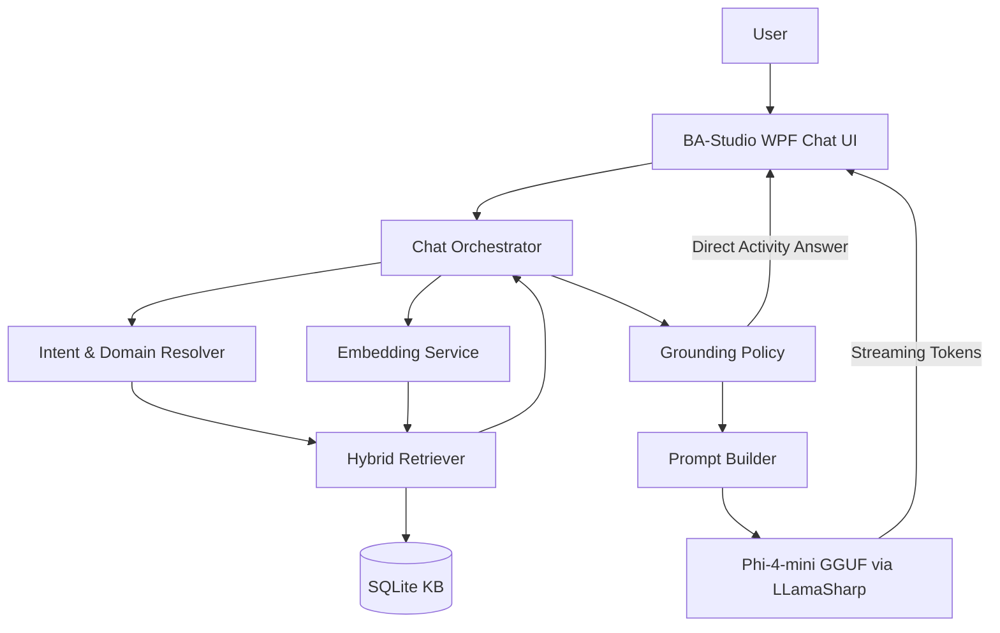

# BA-Studio AI Chatbot 재구현 설계안

## 1. 설계 목표

이번 재구현의 목표는 “로컬 LLM 챗봇”을 만드는 것이 아니라, BA-Studio 매뉴얼과 액티비티 명세를 신뢰성 있게 찾아 답하는 **근거 기반 도움말 챗봇**을 만드는 것이다.

핵심 원칙은 다음과 같다.

- 모델은 `model/microsoft_Phi-4-mini-instruct-Q4_K_M.gguf`를 사용한다.
- 모델은 지식을 외워서 답하지 않고, 검색된 매뉴얼 chunk를 사용자가 이해하기 쉽게 정리하는 역할만 맡는다.
- 매뉴얼에 근거가 없으면 추측하지 않고 되묻거나 “문서에 근거가 부족합니다”라고 답한다.
- 동명이 액티비티가 있는 경우, 예를 들어 `WEB/Click.md`, `SAP/Click.md`, `WIN32/ClickAutomation.md`가 섞일 수 있으므로 도메인 판별과 명확화 질문을 필수 기능으로 둔다.
- 품질은 LLM 답변 감상이 아니라 `검색 정확도`, `근거 포함률`, `모름 처리`, `회귀 테스트 통과`로 관리한다.

## 2. 이전 설계의 보완점

기존 문서의 큰 방향인 RAG, WPF 내장, SQLite KB, LLamaSharp 사용은 유지한다. 다만 재구현에서는 다음을 명확히 분리한다.

| 영역 | 기존 방향 | 재구현 방향 |
|---|---|---|
| LLM | Phi-3 기준 예시 중심 | Phi-4-mini GGUF 기준, 프롬프트 형식/컨텍스트 예산 재정의 |
| 검색 | 벡터 검색 중심 | 키워드 + 도메인 의도 + 벡터 재정렬 + MMR |
| 액티비티 답변 | LLM 생성 의존 | 직접 조회형 질문은 구조화 답변 경로 우선 |
| 품질 | 스모크/회귀 도구 언급 | 배포 차단 기준과 오답 교정 루프까지 포함 |
| 운영 | 리소스 관리 언급 | 모델 지연 로딩, AppData 캐시, 로그/성능 지표 표준화 |

## 3. 전체 아키텍처



## 4. 프로젝트 구조

권장 구현 구조는 다음과 같다.

```text
src/
  BAStudio.Chatbot/
    Contracts/
    Orchestration/
    Retrieval/
    Prompting/
    Policies/
    Telemetry/

  BAStudio.Chatbot.Infra/
    Embedding/
    VectorStore/
    Inference/
    Resources/

  BAStudio.Wpf/
    Views/
    ViewModels/
    Services/

  Tools.CommandsDocGenerator/
  Tools.KbBuilder/
  Tools.RetrievalSmokeTest/
  Tools.RetrievalRegression/
  Tools.AnswerRegression/

ChatBot/
  microsoft_Phi-4-mini-instruct-Q4_K_M.gguf
  embedding_model.onnx
  tokenizer.vocab.txt
  ba_manual_vector.db
```

현재 레포에는 `src` 코드가 없으므로, 재구현은 위 구조를 새로 만든다는 전제로 진행한다. 기존 `docs/generated/commands/*`와 `commands.json`은 KB 입력 데이터로 재사용한다.

## 5. 런타임 컴포넌트

### 5.1 WPF Chat UI

역할:

- 채팅 목록, 입력창, 전송/취소 버튼 제공
- 모델 준비 중, 검색 중, 답변 생성 중 상태 표시
- 스트리밍 토큰을 30~60ms 단위로 묶어 UI에 반영
- 답변의 `[근거]`를 접거나 펼칠 수 있게 표시

정책:

- 기본은 한 번에 하나의 질문만 처리한다.
- 사용자가 취소하면 현재 추론을 중단하고 다음 질문을 바로 받을 수 있어야 한다.
- 모델 최초 로딩은 챗봇 창 첫 오픈 시 지연 실행한다.

기타:

- .NET 8.0을 사용한다.  

### 5.2 Chat Orchestrator

역할:

1. 질문 정규화
2. 도메인/의도 판별
3. 임베딩 생성
4. 하이브리드 검색
5. 모호성/근거 부족 판단
6. 직접 답변 또는 LLM 프롬프트 생성
7. 스트리밍 응답 반환
8. 로그/성능 지표 기록

Orchestrator는 UI, 임베딩, 검색, 추론을 직접 알지 않고 인터페이스에 의존한다.

```csharp
public interface IChatOrchestrator
{
    IAsyncEnumerable<ChatStreamEvent> AskAsync(
        ChatRequest request,
        CancellationToken cancellationToken);
}
```

### 5.3 Intent & Domain Resolver

품질 문제의 상당수는 “Click”처럼 이름이 겹치는 액티비티에서 발생한다. 따라서 질문에서 도메인 힌트를 먼저 뽑는다.

도메인 힌트 예시:

| 힌트 | 우선 도메인 |
|---|---|
| 브라우저, 웹, selector, html, url, alert | `WEB` |
| 엑셀, workbook, sheet, cell, range | `EXCEL` |
| 윈도우, 프로그램, exe, 창, UI Automation | `WIN32` |
| SAP, 세션, SAP GUI | `SAP` |
| 안드로이드, 앱, adb, apk, 모바일 | `ANDROID` |
| 파일, 폴더, 경로 | `FILE` |
| 프로세스, 반복, 조건, 예외 | `BuiltIn`, `COMMON` |

의도 유형:

- `ActivityLookup`: 특정 액티비티 사용법, 속성, 기본값 질문
- `ActivityRecommendation`: 어떤 액티비티를 써야 하는지 묻는 질문
- `Troubleshooting`: 오류 원인/해결 질문
- `HowTo`: 작업 절차 질문
- `OutOfScope`: BA-Studio 매뉴얼 밖 질문

### 5.4 Embedding Service

요구사항:

- KB 생성 시 사용한 임베딩 모델과 런타임 질문 임베딩 모델은 반드시 동일해야 한다.
- 결과 벡터는 L2 정규화한다.
- ONNX 임베딩 모델이 없거나 로드 실패 시 운영 모드에서는 명확한 오류를 띄운다.
- 개발/테스트 모드에서만 해시 임베딩 폴백을 허용한다.

권장:

- 한국어/영문 혼합 질의와 액티비티명 검색에 강한 sentence embedding 모델을 사용한다.
- `tokenizer.vocab.txt`와 ONNX I/O 이름을 KB 메타데이터에 함께 기록한다.

### 5.5 Hybrid Retriever

검색은 단일 벡터 유사도만 쓰지 않는다.

검색 단계:

1. 질문에서 액티비티명 후보와 도메인 후보 추출
2. SQLite FTS5로 키워드 후보 검색
3. 액티비티명/도메인/source 힌트로 후보 boost
4. 질문 임베딩으로 cosine similarity 재정렬
5. MMR로 중복 chunk 제거
6. minScore 미달 결과 제거
7. 상위 결과의 도메인 충돌 여부 검사

검색 점수 예시:

```text
finalScore =
  vectorScore * 0.55
  + keywordScore * 0.25
  + domainBoost * 0.12
  + activityNameBoost * 0.08
```

초기값:

- `TopK`: 6
- `CandidateLimit`: 80
- `MinScore`: 데이터로 튜닝
- `MMR lambda`: 0.7

### 5.6 Grounding Policy

LLM 호출 전에 아래 정책을 판단한다.

직접 답변 경로:

- “WEB Click 속성 알려줘”
- “Click의 retry 기본값은?”
- “OpenBrowser 액티비티 요약”
- “Excel SetCellValue 사용법”

이 경우 LLM을 호출하지 않고 검색된 문서의 Summary, Metadata, Properties를 구조화해서 답한다. 이렇게 하면 속성명/기본값 환각을 크게 줄일 수 있다.

명확화 질문 경로:

- “Click 알려줘”처럼 `WEB`, `SAP`, `WIN32`, `ANDROID` 중 무엇인지 불명확한 경우
- 상위 검색 결과가 서로 다른 도메인에 비슷한 점수로 분산된 경우

예:

```text
어떤 Click 액티비티를 찾으시나요?
- WEB/Click: 웹 엘리먼트 클릭
- SAP/Click: SAP 요소 클릭
- WIN32/ClickAutomation: Windows UI Automation 클릭
```

근거 부족 경로:

- 검색 결과가 없거나 minScore 미달
- 검색 결과는 있지만 질문의 핵심 엔티티와 맞지 않는 경우

응답:

```text
문서에 근거가 부족합니다. BA-Studio의 어떤 도메인이나 액티비티에 대한 질문인지 조금 더 알려주세요.
```

### 5.7 Prompt Builder

Phi-4-mini는 Instruct 모델이므로, 프롬프트는 짧고 강하게 구성한다.

기본 템플릿:

```text
<|system|>
너는 BA-Studio 내장 도움말 챗봇이다.
반드시 [Manual]에 있는 내용만 근거로 답변한다.
[Manual]에 없는 내용은 추측하지 않는다.
속성명, 기본값, 옵션, 액티비티명은 원문 표기를 유지한다.
답변 마지막에는 항상 [근거] 섹션을 만들고 사용한 source를 bullet로 나열한다.
근거가 부족하면 "문서에 근거가 부족합니다"라고 말하고 필요한 추가 정보를 질문한다.
<|end|>

<|user|>
[Manual]
{retrieved_chunks}

[Question]
{user_question}
<|end|>

<|assistant|>
```

생성 파라미터 초기값:

| 항목 | 값 |
|---|---|
| ContextSize | 4096 또는 8192, 실제 Phi-4 GGUF 로딩 가능 범위 확인 후 결정 |
| MaxTokens | 700 |
| Temperature | 0.2 |
| TopP | 0.85 |
| TopK | 40 |
| RepeatPenalty | 1.05 |

RAG 답변은 창의성이 필요 없으므로 temperature는 낮게 시작한다.

## 6. KB 설계

### 6.1 입력 소스

기본 입력:

- `commands.json`
- `docs/generated/commands/**/*.md`
- `docs/quality/*.md`
- 추가 매뉴얼, FAQ, 트러블슈팅 문서

### 6.2 문서 표준 포맷

현재 생성 문서는 다음 구조를 갖고 있어 재사용 가능하다.

```text
# Activity: Click
## Summary
## Metadata
## Properties
## Property Notes
```

재구현에서는 문서 생성 단계에서 아래 메타데이터를 chunk에 명시적으로 저장한다.

- `source`: `WEB/Click.md`
- `group`: `WEB`
- `activityName`: `Click`
- `title`: `Activity: Click`
- `sectionPath`: `Properties/retry`
- `chunkType`: `summary`, `metadata`, `properties`, `property_note`, `example`, `troubleshooting`
- `contentHash`
- `kbVersion`
- `embeddingModelId`

### 6.3 Chunking 전략

액티비티 문서는 의미 단위가 비교적 분명하므로 일반 텍스트 청킹보다 구조 기반 청킹을 우선한다.

권장 chunk:

- Summary chunk
- Metadata chunk
- Properties table chunk
- Property note chunk, 속성별 1개
- Example/Troubleshooting chunk

긴 문서만 600~900자 단위로 추가 분할하고, overlap은 80~120자로 둔다.

### 6.4 SQLite 스키마

```sql
CREATE TABLE kb_chunks (
  id TEXT PRIMARY KEY,
  source TEXT NOT NULL,
  group_name TEXT NOT NULL,
  activity_name TEXT NULL,
  title TEXT NOT NULL,
  section_path TEXT NOT NULL,
  chunk_type TEXT NOT NULL,
  content TEXT NOT NULL,
  content_hash TEXT NOT NULL,
  kb_version TEXT NOT NULL,
  embedding_model_id TEXT NOT NULL,
  updated_at_utc TEXT NOT NULL
);

CREATE TABLE kb_embeddings (
  chunk_id TEXT PRIMARY KEY,
  dim INTEGER NOT NULL,
  vector_blob BLOB NOT NULL,
  FOREIGN KEY(chunk_id) REFERENCES kb_chunks(id) ON DELETE CASCADE
);

CREATE VIRTUAL TABLE kb_chunks_fts USING fts5(
  title,
  source,
  group_name,
  activity_name,
  section_path,
  content,
  content='kb_chunks',
  content_rowid='rowid'
);

CREATE TABLE kb_meta (
  key TEXT PRIMARY KEY,
  value TEXT NOT NULL
);
```

`kb_meta` 필수 키:

- `schema_version`
- `kb_version`
- `created_at_utc`
- `embedding_model_id`
- `embedding_dim`
- `source_commit_or_hash`

## 7. 답변 정책

### 7.1 답변 스타일

기본 응답은 균형형으로 한다.

형식:

```text
{짧은 결론}

{필요한 단계 또는 속성 설명}

[근거]
- {source} / {section}
```

### 7.2 금지

- 매뉴얼에 없는 API, 속성, 옵션을 만들어내기
- 일반 RPA 지식으로 BA-Studio 기능을 단정하기
- 근거 없이 “가능합니다”라고 답하기
- source 없는 답변 생성하기

### 7.3 권장

- 액티비티명, 속성명, 옵션값은 원문 그대로 표기
- 질문이 모호하면 답변보다 명확화 질문 우선
- 도메인 후보가 여러 개면 2~5개 선택지를 제시
- 근거가 약한 경우 “가능성이 있습니다” 대신 “문서에 근거가 부족합니다” 사용

## 8. 배포/운영 설계

### 8.1 파일 위치

설치 폴더:

```text
<InstallDir>/ChatBot/
  microsoft_Phi-4-mini-instruct-Q4_K_M.gguf
  embedding_model.onnx
  tokenizer.vocab.txt
  ba_manual_vector.db
```

쓰기 가능 폴더:

```text
%LOCALAPPDATA%/BAStudio/ChatBot/
  ba_manual_vector.db
  cache/

%LOCALAPPDATA%/BAStudio/Logs/ChatBot/
  chatbot-yyyyMMdd.log
```

설치 폴더의 DB는 읽기 전용 원본으로 보고, 최초 실행 시 AppData로 복사해서 사용한다.

### 8.2 리소스 정책

- 모델은 챗봇 첫 오픈 시 로딩한다.
- 사용자가 챗봇 창을 닫아도 일정 시간은 모델을 유지한다.
- 메모리 압박 또는 유휴 시간이 길면 Dispose한다.
- 모델 로딩 실패, KB 없음, 임베딩 실패는 사용자에게 복구 가능한 메시지로 보여준다.

### 8.3 로그

기본 로그:

- requestId
- 질문 길이
- 의도/도메인 판별 결과
- 검색 TopK source, score
- 명확화 질문 여부
- LLM 호출 여부
- 임베딩 시간
- 검색 시간
- 첫 토큰 시간
- 전체 생성 시간
- 오류 코드

운영 정책상 질문 원문 저장이 허용되어 있으나, 추후 개인정보 마스킹 옵션을 둘 수 있게 인터페이스를 분리한다.

## 9. 품질 게이트

### 9.1 Retrieval Regression

필수 입력:

```json
[
  {
    "id": "web-click-001",
    "question": "웹 버튼 클릭할 때 어떤 액티비티를 써?",
    "expectedSources": ["WEB/Click.md"]
  }
]
```

통과 기준:

- `expectedSources` 중 하나가 Top3 안에 있어야 한다.
- 도메인 힌트가 있는 질문은 해당 도메인 source가 Top1이어야 한다.
- 신규 회귀 실패 허용값은 0이다.

### 9.2 Answer Regression

검사 항목:

- `[근거]` 섹션 존재
- 근거 source가 실제 검색 결과 안에 존재
- 매뉴얼 밖 질문에 모름 처리
- 속성 기본값/옵션이 문서와 일치
- 모호한 질문에서 명확화 질문 반환

### 9.3 필수 테스트 케이스

- `Click` 단독 질문: 명확화 질문
- `웹 Click`: `WEB/Click.md` 우선
- `SAP Click`: `SAP/Click.md` 우선
- `엑셀 셀에 값 입력`: `EXCEL/SetCellValue.md` 우선
- `retry 기본값`: 관련 액티비티가 없으면 되묻기
- 매뉴얼 밖 질문: 근거 부족 답변

## 10. 구현 순서

### 1단계: 기반 프로젝트 생성

- `BAStudio.Chatbot`
- `BAStudio.Chatbot.Infra`
- `BAStudio.Wpf`
- 도구 프로젝트
- 공통 설정 모델

### 2단계: 문서/KB 파이프라인

- `commands.json` 기반 문서 생성기 정리
- 구조 기반 chunker 구현
- SQLite 스키마 생성
- FTS5 인덱스 생성
- 임베딩 저장
- KB 메타데이터 기록

### 3단계: 검색 품질 구현

- 도메인/액티비티 힌트 추출
- FTS 후보 검색
- 벡터 재정렬
- boost/MMR
- 모호성 감지
- 스모크/회귀 테스트 작성

### 4단계: 답변 오케스트레이션

- 직접 답변 경로
- 명확화 질문 경로
- 근거 부족 경로
- Phi-4-mini LLM 생성 경로
- PromptBuilder 구현

### 5단계: WPF 통합

- 챗 UI
- 지연 로딩
- 스트리밍 출력
- 취소
- 오류 표시
- 근거 표시

### 6단계: 운영 마감

- 로그/성능 측정
- AppData DB 복사/버전 비교
- 모델/DB 파일 검증
- 회귀 테스트를 배포 게이트로 연결

## 11. 초기 설정값

| 항목 | 초기값 |
|---|---|
| LLM 모델 | `microsoft_Phi-4-mini-instruct-Q4_K_M.gguf` |
| LLM 로딩 | 챗봇 창 첫 오픈 시 지연 로딩 |
| ContextSize | 4096부터 시작, 성능 확인 후 8192 검토 |
| Temperature | 0.2 |
| MaxTokens | 700 |
| Retrieval TopK | 6 |
| CandidateLimit | 80 |
| MMR | 사용 |
| 답변 스타일 | 균형형 |
| 불확실 질의 | 정확도 우선, 되묻기 |
| 회귀 실패 허용 | 0 |

## 12. 최종 판단

이번 재구현의 성공 기준은 “Phi-4-mini가 자연스럽게 답한다”가 아니다. 사용자가 BA-Studio 액티비티를 물었을 때 올바른 문서를 찾고, 근거를 보여주며, 모호하면 되묻고, 모르면 모른다고 말하는 것이다.

따라서 구현 우선순위는 다음과 같다.

1. KB 품질
2. 검색 정확도
3. 모호성 처리
4. 직접 답변 경로
5. LLM 자연어 품질
6. WPF UX polish

LLM은 마지막 20%를 부드럽게 만드는 구성요소이며, 품질의 80%는 문서 구조화와 검색 파이프라인에서 결정된다.
