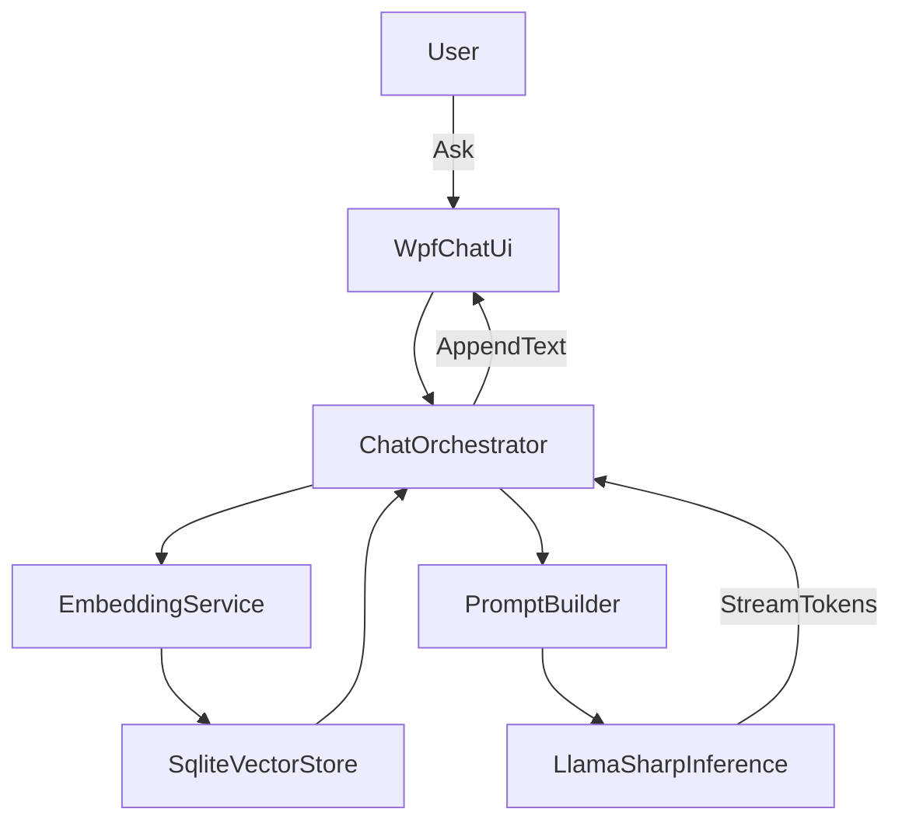

# BA-Studio 내장형 로컬 RAG 챗봇 상세 구현 가이드 (WPF, Phi-3-mini, LLamaSharp)

이 문서는 `chatbot_dev_guide.md`의 개략 설계를 바탕으로, **오프라인(로컬) 환경에서 BA-Studio 프로세스 내부에 내장되는** 챗봇을 실제로 구현할 수 있도록 “설계 → 구현 → 배포/운영”까지 필요한 내용을 상세화합니다.

## 핵심 목표와 제약

- **오프라인 추론**: 네트워크 없이 동작(모델/임베딩/지식베이스 모두 로컬).
- **BA-Studio 프로세스 내장**: 별도 서버 프로세스 없이, BA-Studio 내부에서 라이브러리 형태로 구동.
- **WPF 통합**: UI 멈춤 방지(비동기), 스트리밍 출력, 취소/오류 복구.
- **RAG 품질**: “매뉴얼 기반” 답변에 집중(근거/출처 포함), 매뉴얼 밖 추측 최소화.
- **리소스 관리**: 초기 로딩/메모리/CPU 사용을 BA-Studio 본체에 과도하게 영향 주지 않도록 제한.

## 전제(Assumptions)

문서/코드 예시는 아래 전제를 따릅니다.

- LLM: `Phi-3-mini-4k-instruct-q4.gguf` (또는 동급 GGUF)
- 추론: `LLamaSharp` + CPU 백엔드(기본), GPU 있으면 레이어 오프로딩 옵션
- 임베딩: `embedding_model.onnx` + `Microsoft.ML.OnnxRuntime`
- 벡터 DB: `SQLite` (문서에 명시된 “SQLite-net + Vector Extension” 전제)

> 다른 모델(예: Llama 계열), 다른 벡터 DB(FAISS 등)로 바꾸어도 아키텍처는 동일하되 “임베딩/검색/프롬프트” 부분만 교체하면 됩니다.

---

## 전체 아키텍처 개요

### 컴포넌트 구성(권장)

- **WPF Chat UI**
  - 대화 목록(스트리밍 출력), 입력창, 전송/취소 버튼, 로딩/상태 표시
- **Chat Orchestrator (C# Class Library)**
  - 사용자 요청 수신 → 임베딩 → 검색 → 프롬프트 구성 → 추론 → 스트리밍 출력
  - 취소 토큰/동시성 제어, 오류 처리, 로깅/성능 측정
- **Embedding Service**
  - ONNX Runtime으로 텍스트 → 벡터(정규화 포함)
- **Vector Store (SQLite)**
  - chunk 텍스트, 메타데이터, 벡터(또는 벡터 확장 컬럼) 저장
  - TopK 유사도 검색
- **LLM Inference Service (LLamaSharp)**
  - 모델 로드/언로드, 토큰 스트리밍 생성

### 데이터 흐름



### 스레딩/취소/동시성 원칙

- **UI 스레드에서 무거운 작업 금지**: 임베딩/검색/추론은 백그라운드에서 수행.
- **한 번에 한 질문**: 기본은 “단일 활성 요청” 정책(중복 실행 방지). 필요 시 큐잉 확장.
- **취소 토큰 필수**: 모델 추론/검색/임베딩 단계 모두 `CancellationToken`을 전달.
- **스트리밍 출력**: 토큰 단위로 출력하되, UI 업데이트는 너무 잦지 않게(배치/스로틀) 조절.

---

## 권장 솔루션/프로젝트 구조

아래처럼 “UI/도메인/인프라”를 분리하면 유지보수가 쉬워집니다.

```
BAStudio/
  BAStudio.Wpf/                      (WPF 앱/플러그인)
    Views/ChatWindow.xaml
    ViewModels/ChatViewModel.cs
    Assets/
  BAStudio.Chatbot/                  (Core/Orchestrator 라이브러리)
    Orchestration/
    Prompting/
    Contracts/
    Telemetry/
  BAStudio.Chatbot.Infra/            (DB/ONNX/LLM 구현)
    Embedding/
    VectorStore/
    Inference/
  ChatBot/                           (배포 리소스 폴더, 런타임 동봉)
    Phi-3-mini-4k-instruct-q4.gguf
    embedding_model.onnx
    ba_manual_vector.db
    LLamaSharp.dll, libllama.dll ...
```

> 단일 프로젝트로도 가능하지만, BA-Studio 본체 영향 최소화/테스트/배포 단위 분리를 위해 라이브러리 분리를 권장합니다.

---

## 런타임 파일/배포 폴더 구조(필수)

문서의 기본 구조를 확정/명문화합니다.

```
/ChatBot
  Phi-3-mini-4k-instruct-q4.gguf
  embedding_model.onnx
  ba_manual_vector.db
  (LLamaSharp 및 네이티브 런타임 종속 파일)
```

### 필수 체크

- **모델 파일 경로**: BA-Studio 설치 경로 기준 상대경로를 사용하거나, 설정으로 외부 경로 지정 가능하게 설계.
- **네이티브 DLL 배치**: `libllama.dll` 등 네이티브 파일은 실행 시 로더가 찾는 경로(보통 `bin/`)에 존재해야 함.
- **권한/쓰기 위치**: 설치 폴더가 쓰기 금지일 수 있으므로, **DB는 AppData로 복사 후 사용**하는 전략을 권장.

권장 경로:
- ReadOnly 리소스: `<InstallDir>/ChatBot/*`
- Writable DB/캐시: `%LOCALAPPDATA%/BAStudio/ChatBot/*`

---

## 지식베이스 구축(Data Engineering) 상세

### 1) 입력 데이터(권장)

- BA-Studio 매뉴얼(활동별 사용법/예제)
- 액티비티 스펙(입력/출력/속성/예외/권장값)
- FAQ/트러블슈팅(오류 코드, 흔한 실패 원인, 해결 단계)

### 2) 정제 규칙

- **중복 제거**: 같은 문장이 여러 문서에 반복되면 RAG가 과도하게 편향될 수 있음.
- **정규화**: 코드/프로퍼티 이름은 그대로 유지, 단락 구분/헤더 체계 통일.
- **메타데이터 부여**: 최소한 `source`, `title`, `activityName`, `sectionPath`, `updatedAt`를 유지.

### 3) Chunking(분할) 전략

권장 파라미터(초기값):
- **chunk 길이**: 500~900자(한글 기준) 또는 300~600 토큰(영문 기준)
- **overlap**: 80~150자(또는 50~100 토큰)
- **헤더 우선 분할**: `### Activity: Click` 같은 헤더를 기준으로 섹션 경계를 유지

권장 규칙:
- 액티비티 단위로 먼저 나누고, 그 안에서 “설명/속성/예제/주의사항”을 chunk로 쪼갬
- “표/리스트”는 하나의 chunk로 유지(너무 쪼개면 의미 손실)

### 4) 임베딩 생성

- 문서 chunk와 사용자 질문이 **같은 임베딩 모델**을 사용해야 함.
- 벡터는 코사인 유사도 검색을 위해 **L2 정규화(단위 벡터)** 를 권장.

---

## SQLite 벡터 스토어 설계

아래 스키마는 “문서/출처/벡터/검색용 메타데이터”를 분리해서 관리합니다.

### 권장 테이블 스키마(예시)

```sql
-- Chunk 본문과 메타데이터
CREATE TABLE IF NOT EXISTS kb_chunks (
  id TEXT PRIMARY KEY,
  source TEXT NOT NULL,              -- 예: "manual.md", "faq.md"
  title TEXT NOT NULL,               -- 예: "Click Activity"
  section_path TEXT NOT NULL,         -- 예: "Activity/Click/Properties"
  activity_name TEXT NULL,            -- 예: "Click"
  content TEXT NOT NULL,              -- chunk 텍스트
  content_hash TEXT NOT NULL,         -- 중복/업데이트 판별
  updated_at_utc TEXT NOT NULL
);

-- 벡터 저장 (구현/확장에 따라 형태가 달라질 수 있음)
-- 1) 벡터 확장이 "BLOB 벡터 + 유사도 함수"를 지원한다면 BLOB로 저장
CREATE TABLE IF NOT EXISTS kb_embeddings (
  chunk_id TEXT PRIMARY KEY,
  dim INTEGER NOT NULL,
  vector_blob BLOB NOT NULL,
  FOREIGN KEY(chunk_id) REFERENCES kb_chunks(id) ON DELETE CASCADE
);

CREATE INDEX IF NOT EXISTS idx_kb_chunks_activity ON kb_chunks(activity_name);
CREATE INDEX IF NOT EXISTS idx_kb_chunks_source ON kb_chunks(source);
```

> “SQLite Vector Extension”의 구체 API는 사용하는 확장(예: `sqlite-vss`, `sqlite-vec`, 커스텀)마다 다릅니다. 핵심은 `kb_embeddings.vector_blob`에 저장된 벡터를 대상으로 **TopK cosine(또는 inner product) 검색**을 제공하는 것입니다.

### 검색 결과 품질을 올리는 메타데이터

- `section_path`로 같은 섹션 내 chunk를 우선순위 부여
- `activity_name`으로 특정 액티비티 질문일 때 필터링(옵션)
- `updated_at_utc`로 최신 문서에 가중치(옵션)

---

## Retrieval(검색) 전략

### 기본 TopK

- `TopK = 3~5`로 시작, 길고 복합 질문이면 8~12까지 확대 가능
- **최소 유사도 임계치**를 둬서 관련 없는 문서를 “참고 문서”로 넣지 않기
  - 예: cosine < 0.25(모델/데이터에 따라 조정)

### 중복 제거/다양성(MMR, 선택)

비슷한 chunk가 몰려 나오면 답이 편향됩니다. 가능하면:
- 첫 결과는 최고 유사도
- 이후는 “유사도는 유지하면서 기존 결과들과는 덜 비슷한” chunk 선택(MMR)

---

## 프롬프트 설계(핵심)

### 목표

- 모델이 **제공된 매뉴얼 chunk만 근거로** 답변하도록 강제
- 답변에 **근거(출처/섹션)** 를 포함
- 모르는 경우 **모른다고 말하고**, 필요한 추가 정보 요청(예: 어떤 화면/버전인지)

### 권장 프롬프트 템플릿(Phi-3 계열)

```text
<|system|>
너는 BA-Studio 내장 도움말 챗봇이다.
아래 [Manual] 내용만 근거로 답변하라.
[Manual]에 없는 내용은 추측하지 말고, "문서에 근거가 부족합니다"라고 말한 뒤 필요한 추가 정보를 질문하라.
답변 마지막에 항상 [근거] 섹션으로 출처를 bullet로 나열하라.

[Manual]
{retrieved_chunks_formatted}

<|user|>
{user_question}
<|assistant|>
```

### retrieved_chunks_formatted 포맷(권장)

- chunk마다 구분자를 넣고, 최소 메타데이터를 함께 제공:
  - `source`, `title`, `section_path`, (가능하면) `activity_name`

예:

```text
--- chunk 1
source: manual_click.md
title: Click Activity
section: Activity/Click/Properties
content:
...

--- chunk 2
...
```

---

## 대화 메모리/컨텍스트 관리

### 왜 필요한가

로컬 모델은 컨텍스트 제한(예: 4k) 때문에, 대화가 길어지면:
- 과거 대화 + 매뉴얼 chunk + 질문이 한 번에 못 들어갈 수 있음
- 모델이 “중요한 제약(버전/상황)”을 잊을 수 있음

### 권장 전략(초기 구현)

- **최근 N턴 윈도우**: 최근 3~6턴만 유지
- **요약 메모**(선택): 특정 정보(BA-Studio 버전, OS, 오류 코드, 사용 중 액티비티)를 “키-값 상태”로 별도 유지
- **토큰 예산**(권장):
  - Manual: 1200~2000 토큰
  - 대화 히스토리: 600~1200 토큰
  - 답변: 400~800 토큰

---

## LLamaSharp 추론 구현 가이드

### 로드/세션/스트리밍의 원칙

- 앱 시작 시 즉시 로드하지 말고, **챗 창 첫 오픈 시 로드(지연 로딩)** 권장
- 로딩 중 UX: “AI 엔진을 준비 중입니다…” + 진행 상태(가능한 범위)
- 한 번 로드한 모델은 재사용하되, 메모리 압박이 크면 유휴 시 언로드 옵션 제공

### 파라미터 튜닝(초기값)

- `ContextSize`: 모델 컨텍스트에 맞춰(4k 모델이면 4096)
- `Temperature`: 0.3~0.8 (RAG Q/A는 낮게가 안전)
- `TopP`: 0.9 전후
- `MaxTokens`: UI/성능을 고려해 제한(예: 512~1024)

---

## 임베딩(ONNXRuntime) 구현 가이드

### 구현에서 가장 흔한 함정

- ONNX 모델이 **토크나이저를 포함하지 않는 경우**가 많음
  - 이 경우 C#에서 토크나이징(WordPiece/BPE)을 별도로 해야 함
- 임베딩이 문장 단위인지, 토큰 단위인지(Mean pooling 필요 여부)
- 결과 벡터 **정규화** 여부(코사인 검색 품질에 영향)

### 권장 접근

1) 임베딩 모델 선택 시 “C#에서 토크나이저 구현 가능 여부”를 먼저 확인  
2) 초기에는 “토크나이저 포함(또는 함께 제공되는) 모델”로 복잡도 감소  
3) 벡터는 저장/검색 전에 L2 정규화

---

## WPF UI 통합 상세

### UI 구성(권장)

- 채팅 히스토리: `ItemsControl`(또는 `ListBox`) + DataTemplate(사용자/봇 버블)
- 입력: `TextBox`(Enter 전송, Shift+Enter 줄바꿈)
- 버튼: 전송/취소, 옵션(모델 상태, KB 버전)
- 상태: 로딩(모델 로딩/검색/생성 단계), 에러 토스트

### 스트리밍 출력 패턴(권장)

핵심은:
- 생성 토큰을 즉시 UI에 반영하되,
- UI 업데이트를 과도하게 하지 않도록(예: 30~60ms 단위로 버퍼 flush)

### 취소 UX

- “취소” 클릭 시:
  - 현재 요청의 `CancellationTokenSource.Cancel()`
  - 스트리밍 중단 후 “중단됨” 표시
- 다음 질문은 즉시 가능하도록 상태 복구

---

## 최소 구현 스니펫(“그대로 옮겨 적기”용)

이 섹션은 “완전 구현”에 필요한 뼈대를 빠르게 세팅하기 위한 **최소 스니펫**입니다. 실제 프로젝트에서는 예외 처리/로깅/DI(의존성 주입)를 추가하세요.

### 1) LLamaSharp: 모델 로드 + 스트리밍 생성(취소 포함)

```csharp
using LLama;
using LLama.Common;

public sealed class LlmService : IDisposable
{
    private readonly LLamaWeights _weights;
    private readonly LLamaContext _context;
    private readonly ChatSession _session;

    public LlmService(string ggufPath, int contextSize = 4096, int gpuLayers = 0)
    {
        var parameters = new ModelParams(ggufPath)
        {
            ContextSize = contextSize,
            GpuLayerCount = gpuLayers,
        };

        _weights = LLamaWeights.LoadFromFile(parameters);
        _context = _weights.CreateContext(parameters);
        var executor = new InteractiveExecutor(_context);
        _session = new ChatSession(executor);
    }

    public async IAsyncEnumerable<string> StreamAnswerAsync(
        string prompt,
        float temperature = 0.5f,
        int maxTokens = 768,
        [System.Runtime.CompilerServices.EnumeratorCancellation] CancellationToken cancellationToken = default)
    {
        var inference = new InferenceParams
        {
            Temperature = temperature,
            MaxTokens = maxTokens,
        };

        await foreach (var token in _session.ChatAsync(prompt, inference, cancellationToken))
        {
            yield return token;
        }
    }

    public void Dispose()
    {
        _session?.Dispose();
        _context?.Dispose();
        _weights?.Dispose();
    }
}
```

### 2) ONNXRuntime: 임베딩 실행(정규화 포함, “입력 전처리”는 모델에 맞게 교체)

아래 코드는 **“ONNX 모델이 `input_ids`/`attention_mask`를 받는 BERT류”** 를 가정한 형태입니다. 실제 `embedding_model.onnx`의 입력/출력 이름은 모델마다 다르므로, 먼저 Netron 등으로 I/O 텐서 이름을 확인하세요.

```csharp
using Microsoft.ML.OnnxRuntime;
using Microsoft.ML.OnnxRuntime.Tensors;

public sealed class EmbeddingService : IDisposable
{
    private readonly InferenceSession _session;
    private readonly int _maxLen;

    public EmbeddingService(string onnxPath, int maxLen = 256)
    {
        _maxLen = maxLen;
        _session = new InferenceSession(onnxPath);
    }

    public float[] Embed(string text)
    {
        // TODO: 모델에 맞는 토크나이저/인코더로 교체
        // 아래는 "이미 토큰화된 결과를 얻었다"는 가정용 더미 구조.
        (long[] inputIds, long[] attentionMask) = DummyTokenize(text, _maxLen);

        var inputIdsTensor = new DenseTensor<long>(inputIds, new[] { 1, _maxLen });
        var attentionMaskTensor = new DenseTensor<long>(attentionMask, new[] { 1, _maxLen });

        var inputs = new List<NamedOnnxValue>
        {
            NamedOnnxValue.CreateFromTensor("input_ids", inputIdsTensor),
            NamedOnnxValue.CreateFromTensor("attention_mask", attentionMaskTensor),
        };

        using var results = _session.Run(inputs);

        // TODO: 출력 텐서 이름/shape에 맞게 추출
        // 예: sentence embedding이 (1, dim)으로 나오는 경우
        var embedding = results.First().AsEnumerable<float>().ToArray();

        return L2Normalize(embedding);
    }

    private static float[] L2Normalize(float[] v)
    {
        double sumSq = 0;
        for (int i = 0; i < v.Length; i++) sumSq += v[i] * v[i];
        var norm = Math.Sqrt(sumSq);
        if (norm <= 0) return v;

        var outV = new float[v.Length];
        for (int i = 0; i < v.Length; i++) outV[i] = (float)(v[i] / norm);
        return outV;
    }

    private static (long[] inputIds, long[] attentionMask) DummyTokenize(string _text, int maxLen)
    {
        var inputIds = new long[maxLen];
        var mask = new long[maxLen];
        // 실제 구현에서는 CLS/SEP 포함, 패딩/트렁케이션 반영
        mask[0] = 1;
        inputIds[0] = 101; // [CLS] 같은 토큰(예시)
        return (inputIds, mask);
    }

    public void Dispose() => _session.Dispose();
}
```

### 3) SQLite 검색 레이어: “벡터 확장 의존”을 인터페이스로 감싸기

SQLite 벡터 확장 API는 프로젝트마다 다르므로, 아래처럼 **벡터 검색 부분만 교체 가능하게 분리**하는 것을 권장합니다.

```csharp
public sealed record RetrievedChunk(
    string Id,
    string Source,
    string Title,
    string SectionPath,
    string? ActivityName,
    string Content,
    float Score);

public interface IVectorStore
{
    Task<IReadOnlyList<RetrievedChunk>> SearchAsync(
        float[] queryEmbedding,
        int topK,
        float minScore,
        CancellationToken cancellationToken);
}
```

> 구현체(`SqliteVectorStore`)에서는 “queryEmbedding → TopK cosine”을 수행하도록 작성합니다. 벡터 확장이 제공하는 함수/가상테이블에 맞춰 쿼리만 바꾸면 됩니다.

### 4) Orchestrator: RAG 파이프라인(임베딩→검색→프롬프트→스트리밍)

```csharp
public sealed class ChatOrchestrator
{
    private readonly EmbeddingService _embeddings;
    private readonly IVectorStore _vectorStore;
    private readonly LlmService _llm;

    public ChatOrchestrator(EmbeddingService embeddings, IVectorStore vectorStore, LlmService llm)
    {
        _embeddings = embeddings;
        _vectorStore = vectorStore;
        _llm = llm;
    }

    public async IAsyncEnumerable<string> AskAsync(
        string userQuestion,
        int topK = 5,
        float minScore = 0.25f,
        [System.Runtime.CompilerServices.EnumeratorCancellation] CancellationToken cancellationToken = default)
    {
        var q = _embeddings.Embed(userQuestion);

        var chunks = await _vectorStore.SearchAsync(q, topK, minScore, cancellationToken);
        var manual = FormatChunksForPrompt(chunks);
        var prompt = BuildPrompt(manual, userQuestion);

        await foreach (var token in _llm.StreamAnswerAsync(prompt, cancellationToken: cancellationToken))
        {
            yield return token;
        }
    }

    private static string FormatChunksForPrompt(IReadOnlyList<RetrievedChunk> chunks)
    {
        if (chunks.Count == 0) return "(검색된 매뉴얼이 없습니다)";

        var sb = new System.Text.StringBuilder();
        for (int i = 0; i < chunks.Count; i++)
        {
            var c = chunks[i];
            sb.AppendLine($"--- chunk {i + 1}");
            sb.AppendLine($"source: {c.Source}");
            sb.AppendLine($"title: {c.Title}");
            sb.AppendLine($"section: {c.SectionPath}");
            if (!string.IsNullOrWhiteSpace(c.ActivityName))
                sb.AppendLine($"activity: {c.ActivityName}");
            sb.AppendLine("content:");
            sb.AppendLine(c.Content);
            sb.AppendLine();
        }
        return sb.ToString();
    }

    private static string BuildPrompt(string retrievedChunksFormatted, string userQuestion)
    {
        return $"""
<|system|>
너는 BA-Studio 내장 도움말 챗봇이다.
아래 [Manual] 내용만 근거로 답변하라.
[Manual]에 없는 내용은 추측하지 말고, "문서에 근거가 부족합니다"라고 말한 뒤 필요한 추가 정보를 질문하라.
답변 마지막에 항상 [근거] 섹션으로 출처를 bullet로 나열하라.

[Manual]
{retrievedChunksFormatted}

<|user|>
{userQuestion}
<|assistant|>
""";
    }
}
```

### 5) WPF ViewModel: 스트리밍 UI 업데이트 + 취소

아래는 “단일 활성 요청” 정책(요청 중 재전송 방지)을 가정합니다.

```csharp
public sealed class ChatViewModel
{
    private readonly ChatOrchestrator _orchestrator;
    private CancellationTokenSource? _cts;

    public string InputText { get; set; } = "";
    public string OutputText { get; private set; } = "";
    public bool IsBusy { get; private set; }

    public ChatViewModel(ChatOrchestrator orchestrator)
    {
        _orchestrator = orchestrator;
    }

    public async Task SendAsync()
    {
        if (IsBusy) return;
        if (string.IsNullOrWhiteSpace(InputText)) return;

        IsBusy = true;
        OutputText = "";

        _cts = new CancellationTokenSource();
        var ct = _cts.Token;

        try
        {
            var buffer = new System.Text.StringBuilder();
            var lastFlush = Environment.TickCount64;

            await foreach (var token in _orchestrator.AskAsync(InputText, cancellationToken: ct))
            {
                buffer.Append(token);

                // 40ms 단위 스로틀(예시): UI 업데이트 과다 방지
                var now = Environment.TickCount64;
                if (now - lastFlush >= 40)
                {
                    var textToAppend = buffer.ToString();
                    buffer.Clear();
                    lastFlush = now;

                    await System.Windows.Application.Current.Dispatcher.InvokeAsync(() =>
                    {
                        OutputText += textToAppend;
                        // TODO: INotifyPropertyChanged로 바인딩 갱신
                    });
                }
            }

            if (buffer.Length > 0)
            {
                var tail = buffer.ToString();
                await System.Windows.Application.Current.Dispatcher.InvokeAsync(() =>
                {
                    OutputText += tail;
                });
            }
        }
        catch (OperationCanceledException)
        {
            await System.Windows.Application.Current.Dispatcher.InvokeAsync(() =>
            {
                OutputText += "\n\n(생성이 취소되었습니다)";
            });
        }
        finally
        {
            _cts?.Dispose();
            _cts = null;
            IsBusy = false;
        }
    }

    public void Cancel() => _cts?.Cancel();
}
```

---

## 오류 처리/복구 설계

### 실패 케이스 목록(최소)

- 모델 파일 없음/손상/경로 오류
- `libllama.dll` 등 네이티브 로드 실패
- 임베딩 ONNX 로드 실패(모델/세션 초기화)
- SQLite DB 없음/스키마 불일치/손상(읽기 실패)
- 검색 결과 0개 또는 임계치 미달
- 추론 중 OOM(메모리 부족) 또는 너무 느림(타임아웃)

### 사용자에게 보여줄 메시지(권장)

- 원인(가능한 범위) + 해결 방법 + 로그 위치
- 예:
  - “AI 모델을 찾을 수 없습니다. 설치 폴더의 `ChatBot/Phi-3...gguf`를 확인하세요.”
  - “지식베이스가 비어 있습니다. `ba_manual_vector.db` 업데이트가 필요합니다.”

---

## 관측성(Logging/Telemetry) & 성능 측정

오프라인 앱에서도 문제 분석을 위해 아래를 남기는 것을 권장합니다.

- 단계별 시간(ms)
  - 임베딩 시간
  - 검색 시간
  - 프롬프트 구성 시간
  - 첫 토큰까지 시간(TTFT)
  - 전체 생성 시간
- 입력/출력 길이(토큰/문자)
- 선택된 TopK chunk 메타데이터(내용 전문은 선택)

로그 출력 위치 권장:
- `%LOCALAPPDATA%/BAStudio/Logs/ChatBot/`

---

## 테스트 전략(오프라인)

### 회귀 질문셋(권장)

- 액티비티별 대표 질문 5~10개
- 오류/트러블슈팅 질문 20~50개(현업에서 자주 나오는 것)
- 매뉴얼에 없는 질문(“모른다”를 잘 말하는지 확인)

### 품질 기준(예시)

- **근거 포함률**: 답변 100%에 [근거] 섹션 포함
- **환각 억제**: 매뉴얼 밖 질문에서 추측 답변 비율 최소화
- **성능**:
  - 모델 로드: 5~15초(PC 사양에 따라)
  - 검색: 50~200ms(로컬 DB/인덱스 기준)
  - TTFT: 1~4초(로컬 CPU 기준)

---

## 배포/업데이트 전략

### MSI 포함 vs 최초 실행 다운로드

1) **MSI 포함(오프라인 완전성 최우선)**
- 장점: 설치 후 즉시 오프라인 사용 가능
- 단점: 설치 용량/배포 부담 큼(모델 2GB+)

2) **최초 실행 다운로드(배포 편의)**
- 장점: 설치 파일 작음, 업데이트/교체 쉬움
- 단점: 최초 실행에 네트워크 필요(오프라인 전제와 충돌 가능)

오프라인 목표가 강하면 1)을 권장하되, 사내 배포 서버/USB 등으로 제공하는 방식도 고려합니다.

### 지식베이스(DB)만 업데이트

- `ba_manual_vector.db` 버전(스키마/임베딩 모델 버전) 명시
- 업데이트 시:
  - 새 DB 다운로드/복사 → 무결성 확인 → 스왑(원자적 교체)

---

## 보안/안정성 체크

- **프롬프트 인젝션 완화**
  - “매뉴얼만 근거” 규칙을 시스템 프롬프트에 고정
  - 검색 chunk에도 “지시문”이 포함되면 무시하도록(간단한 필터링/정책)
- **로컬 데이터 보호**
  - 로그에 사용자 입력/회사 기밀이 남을 수 있으므로 로그 마스킹 옵션 제공
- **경로/권한**
  - 설치 폴더 쓰기 금지 대비(AppData로 복사)

---

## 구현 단계별 체크리스트(5단계 확장)

### 1단계: 지식베이스 구축

- [ ] 문서 소스 수집/정제 규칙 확정
- [ ] chunking 파라미터 확정(길이/오버랩/헤더)
- [ ] 임베딩 모델/토크나이저 호환 확인
- [ ] SQLite 스키마/버전 정책 확정
- [ ] DB 생성 파이프라인(오프라인 배치) 구축

### 2단계: C#/.NET 환경 설정(WPF)

- [ ] WPF UI 프로젝트 준비
- [ ] `LLamaSharp` 및 백엔드 패키지 설치
- [ ] `Microsoft.ML.OnnxRuntime` 설치
- [ ] 네이티브 DLL 배포 경로/복사 정책 확정

### 3단계: 로컬 RAG 로직 구현

- [ ] 질문 임베딩(정규화 포함)
- [ ] TopK 검색 + 임계치 + 중복 제거
- [ ] 프롬프트 템플릿 적용(근거/모른다 정책)
- [ ] 대화 메모리(윈도잉/요약) 적용

### 4단계: WPF UI 통합

- [ ] 비동기 실행 + UI 프리즈 방지
- [ ] 스트리밍 출력(버퍼/스로틀)
- [ ] 취소/에러 메시지/로딩 표시
- [ ] 사용자 편의(Enter 전송, 복사 버튼, 출처 펼치기)

### 5단계: 배포 및 최적화

- [ ] 모델 로드 시간/메모리 측정 및 UX 튜닝
- [ ] 로그/성능 측정 포인트 확정
- [ ] MSI(또는 사내 배포) 제작
- [ ] DB만 업데이트하는 교체 절차 마련

